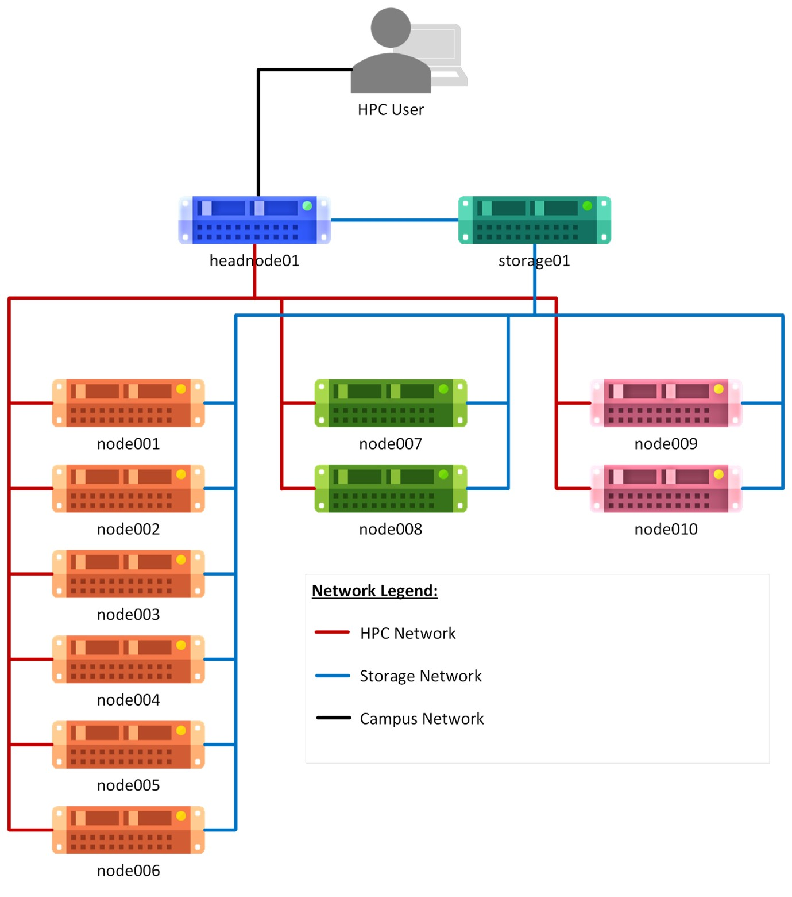

# SUfRs - HPC Workshop
## Overview of the Practical System
The system used in this practical session is GES Petrarch. This cluster was built by RCaaS HPC Engineers with hardware provided by the School of Geography and Earth Sciences within the College of Science and Engineering at the University of Glasgow in 2023-2024.

The School of Geography and Earth Sciences allowed us to use this platform for the purpose of this workshop, however, as of now the cluster is only available to users of this school.



## Connecting
Go ahead and open your terminal, then log in to the cluster. Replace `<yourUsername>` with the username on your credential sheet supplied by the instructors.

```
$ ssh <yourUsername>@headnode01.hpc.gla.ac.uk
```

If prompted, you can trust the login-node by typing `yes` then `Enter`. 

You can find the password on your credential sheet supplied by the instructors. Watch out: the characters you type after the password prompt are not displayed on the screen. Normal output will resume once you press `Enter`.

When you are logged in, you can use the `who` command to see who else is currently logged into the system. You can see that you are all using the same server with the same resources.

```
[<yourUsername>@headnode01 ~]$ who
sufrs01   pts/0        <date-time> (<IP>)
sufrs04   pts/0        <date-time> (<IP>)
sufrs15   pts/0        <date-time> (<IP>)
…
```

## Storage
If you use `pwd`, you should see you are currently in your home directory:

```
[<yourUsername>@headnode01 ~]$ pwd
/mnt/home/<yourUsername>
```

Have a look at the contents of your current directory in list form using `ls -l` and you should see that your workshop material is already there. You can also see that you have both your local- and sharedscratch directory linked to you in your home for easy access.

```
[<yourUsername>@headnode01 ~]$ ls -l
HPC-Workshop-July-2024    
localscratch -> /tmp/local-scratch/<yourUsername>
sharedscratch -> /tmp/shared-scratch/<yourUsername>
```

You can move data to the system using SFTP / SSH. A very accessible SFTP client with a GUI is WinSCP.

## Software
As the system uses Environment Modules, the available software on the system can be listed using the `module available` command. You will see a list of all available software on the system. In this workshop we will only be using a few.

```
[<yourUsername>@headnode01 ~]$ module available
----------------------- /mnt/software/modules -----------------------
openmpi/5.0.2/gnu1320         gcc/13.2.0
python/3.12.2/gnu1141         apptainer/1.3.0/gnu1141       
R/4.3.2/gnu1141               matlab/r2023b

[removed most of the output here for clarity]
```

Modules can make new software available to you, which you might have not had before. Use the `module load` command, followed by the name of the software you wish to load, as for example here with R:

```
[<yourUsername>@headnode01 ~]$ R --version
-bash: R: command not found
[<yourUsername>@headnode01 ~]$ module load R
[<yourUsername>@headnode01 ~]$ R --version
R version 4.3.2 (2023-10-31) -- "Eye Holes"
Copyright (C) 2023 The R Foundation for Statistical Computing
Platform: x86_64-pc-linux-gnu (64-bit)
```

It can also “overwrite” an already existing software, that is preinstalled on the system, here an example with python:

```
[<yourUsername>@headnode01 ~]$ python3 --version
Python 3.9.18
[<yourUsername>@headnode01 ~]$ module load python
[<yourUsername>@headnode01 ~]$ python3 --version
Python 3.12.2
```

To see all modules, that are loaded into your environment right now, use the `module list` command:

```
[<yourUsername>@headnode01 ~]$ module list
Currently Loaded Modulefiles:
 1) R/4.3.2/gnu1141   2) python/3.12.2/gnu1141
```

If you wish to remove a specific software, use `module unload` followed by the software name. if you want to remove all software from your environment, use `module purge`:

```
[<yourUsername>@headnode01 ~]$ module unload R
[<yourUsername>@headnode01 ~]$ module list
Currently Loaded Modulefiles:
 1) python/3.12.2/gnu1141
[<yourUsername>@headnode01 ~]$ module purge
[<yourUsername>@headnode01 ~]$ module list
No Modulefiles Currently Loaded.
```

Keep in mind, no software is loaded by default! Loading software should be part of a routine in your job. Running a job is just like logging on to the system, you should not assume a module loaded on the login node is loaded on a compute node.

## Scheduler
All the steps from here on are specific to Slurm. There are other schedulers with different syntax, the ideas and functionalities are usually very similar though.
Look at what resources you have available to you on the cluster, using the Slurm `sinfo` command. 

```
[<yourUsername>@headnode01 ~]$ sinfo -o "%n %c %m %G" | column -t
HOSTNAMES  CPUS  MEMORY   GRES
node001    128   1031351  (null)
node002    128   1031351  (null)
node003    128   1031351  (null)
node004    128   1031351  (null)
node005    128   1031351  (null)
node006    128   1031351  (null)
node007    128   2051459  (null)
node008    128   2051459  (null)
node009    32    515087   gpu:rtx6000:2
node010    32    515087   gpu:rtx6000:2
```

The nodes are grouped into partitions in Slurm, this is a way to define what type of machine you want to work with. You can list all available partitions also using the `sinfo` command:

```
[<yourUsername>@headnode01 ~]$ sinfo
PARTITION AVAIL  TIMELIMIT  NODES  STATE NODELIST
cpu*         up   infinite      6   idle node[001-006]
cpuplus      up   infinite      2   idle node[007-008]
cpuall       up   infinite      8   idle node[001-008]
gpu          up   infinite      2   idle node[009-010]
```

For this course, node001 and node002 were reserved, meaning we’ll only be using these two. We also only make use of the default partition “cpu”, which is marked with a * in the output.

## Interactive Job
You can start an interactive job using the `srun` command. You can tell, you are on a different server by the prompt, which should now feature the name of a compute node:

```
[<yourUsername>@headnode01 ~]$ srun --pty bash
[<yourUsername>@node001 ~]$
```

Similar from how you switched from your PC to the login node, we now switched from the login node to the compute node. 

Here we can start doing computational work. As an example, we will run some python3 code.

1. Load the python module
```
[<yourUsername>@node001 ~]$ module load python 
```
2.	Run python3
```
 [<yourUsername>@node001 ~]$ python3
```
3.	Import python libraries
```
 >>> import os
```
4.	Get Slurm node name
```
 >>> node = os.getenv("SLURMD_NODENAME")
```
5.	Get Slurm JobID
```
 >>> jobid = os.getenv("SLURM_JOBID")
```
6.	Open a new text file
```
>>> myfile = open("demofile-" + jobid + ".txt", "w") 
```
7.	Write into the text file
```
 >>> myfile.write("I am doing compute work on " + node)
```
8.	Exit python3
```
 >>> exit()
```

Look at the file you just created using cat. You can see it used the name of the node we are working on in the output.

```
[<yourUsername>@node001 ~]$ cat demofile-<JobID>.txt
I am doing compute work on <ComputeNodeName>
```

This is our interactive job done, lets close our session with the `exit` command. This should bring us back to the login node, as indicated by the prompt again:

```
[<yourUsername>@node001 ~]$ exit
exit
[<yourUsername>@headnode01 ~]$
```

## Batch job submission
If you are thinking the previous example was quite tedious and not very convenient, you will like batch job submissions.

First, we have to save our python code into a file. For this create a file with the .py ending and add the contents of step 3- 7in the interactive job. You can create and edit files using either `vi` or `nano`, whatever is more comfortable to you:

```
[<yourUsername>@headnode01 ~]$ nano myPythonCode.py
```
```
import os
node = os.getenv("SLURMD_NODENAME")
myfile = open("demofile-" + jobid + ".txt", "w")
myfile.write("I am doing compute work on " + node)
exit()
```

Within your workshop material you should find a job script template. Copy the template and edit it:

```
[<yourUsername>@headnode01 ~]$ cp HPC-Workshop-July-2024/jobSubmissionTemplate.sh myPythonJob.sh
[<yourUsername>@headnode01 ~]$ nano myPythonJob.sh
```

Under the “Loading Software” subtitle add the required software, like in the interactive job example:

```
…
############# LOADING SOFTWARE #############
module load python
…
```

In the “My Code” section run the script you saved earlier by providing it as a parameter to the python3 executable:

```
…
############# MY CODE #############
python3 myPythonCode.py
```

Now you can submit your job using the `sbatch` utility and the path to the script:

```
[<yourUsername>@headnode01 ~]$ sbatch myPythonJob.sh
```

Within your current working directory, you should now find an output file named after your JobID and the file your python script created. Since your home storage is shared across all servers, you can see the output of your scripts in real time from the headnode, even if the job ran on a compute node:

```
[<yourUsername>@headnode01 ~]$ ls -l
slurm-<JobID>.out
demofile-<JobID>.txt
```

You can run this job as many times as you want by just using the sbatch command. Like this you have access to the power of the HPC compute nodes, without ever having to log into one yourself.

You can also use the HPC to run parallel jobs. For this you’ll need a program, that I capable to do this. In our example, we are running a simple MPI program, that just reports back where it ran.

You can copy the example script form the workshop materials. Have a look at the script and note, that we set it to run over 2 nodes, with 4 tasks each:

```
[<yourUsername>@headnode01]$ cp HPC-Workshop-July-2024/parallelTestJob.sh myParallelTestJob.sh
[<yourUsername>@headnode01]$ cat myParallelTestJob.sh
```

Run the job using `sbatch` and look at the output file. MPI ran the program on each detected task on each node and wrote a message to the console. Slurm collects all these outputs in the slurm-<JobID>.out file:

```
[<yourUsername>@headnode01]$ sbatch myParallelTestJob.sh
[<yourUsername>@headnode01]$ cat slurm-<JobID>.out
```

## Job monitoring and resource efficiency
Copy the monitoring example script from the workshop materials and have a look at it in your console. Every step of the script is described with a comment above:

```
[<yourUsername>@headnode01]$ cp HPC-Workshop-July-2024/monitoringTestJob.sh myMonitoringTestJob.sh
[<yourUsername>@headnode01]$ cat myMonitoringTestJob.sh
```

The script does not need any adjustments and can be ran as is using `sbatch` to submit it to the scheduler. Upon submission you should get a JobID printed to the console, we will use this for the coming queries, indicated by <JobID>:

```
[<yourUsername>@headnode01]$ sbatch myMonitoringTestJob.sh
Submitted batch job <JobID>
```

You can see all running jobs on the system using the `squeue` command. If you only want to see your own jobs, you can specify your username with the `-u` parameter. If you only want to see your job queued earlier, you can use the `-j` parameter followed by your JobID.

```
[<yourUsername>@headnode01]$ squeue
[<yourUsername>@headnode01]$ squeue -u <yourUsername>
[<yourUsername>@headnode01]$ squeue -j <JobID>
```

The output is as follows:
- **JOBID**: Unique identifier of the job. Counts up from 1 being the first job ever queued.
- **PARTITION**: Scheduler partition the job is queued into.
- **NAME**: Name of the job as defined by --job-name in your submission or your script name.
- **USER**: User who submitted the job to the scheduler the job.
- **ST**: Status of the job: R=Running, PD=Pending.
- **TIME**: Time the job has been running for.
- **NODES**: Number of nodes.
- **NODELIST**: List of names of allocated nodes.

By now your job should be finished. Use `squeue` to check if your job is still running. By default, jobs, that are not running or pending, will not show in the list.

Slurm keeps a database with information of all jobs run using the system. To access this data, you can use the `sacct` command. Using the JobID you saved from your job, we can show a wide list of information for your job. Use the `-o` parameter followed by a list of Job-Accounting-Fields.

A list of all available Job-Accounting-Fields can be found here: [sacct manual](https://slurm.schedmd.com/sacct.html#SECTION_Job-Accounting-Fields)

In our first example, we’ll show an overview of the requested resources for that job. You should see, these are the values we provided in the “SLURM SETTINGS” section of the script:

```
[<yourUsername>@headnode01]$ sacct -j <JobID> -o JobID,User,ReqCPUS,ReqMem,ReqNodes,TimeLimit -X
```

Now let’s get some more information on how and where our job ran. In this output we see that the job ran for 3 minutes, and it completed with exit code 0, which means there were no errors:

```
[<yourUsername>@headnode01]$ sacct -j <JobID> -o JobID,NodeList,Start,End,Elapsed,State,ExitCode -X
```

Say we want to check if our job ran efficiently, we could use the `seff` command. It uses data from the Slurm accounting database, to create information on how efficiently your job ran. Let’s use this utility and try to adjust our script, so it is more efficiently specified:

```
[<yourUsername>@headnode01]$ seff <JobID>
```

Based on the following three lines, we’ll make the adjustments on your script. Its fine to have a little bit of a buffer, we don’t want a job to get killed just because it overran a couple of seconds of what is expected:

```
CPU Efficiency: 49.92% of 00:12:00 core-walltime
Job Wall-clock time: 00:03:00
Memory Utilized: 532.00 KB
```
```
#SBATCH --cpus-per-task=2
#SBATCH --time=0-00:04:00
#SBATCH --mem=1M
```
Save the changes and run the job again. Once it is done running check the efficiency using `seff` again.

Accurate job scripts help the queuing system efficiently allocate shared resources. And therefore, your jobs should run quicker.
